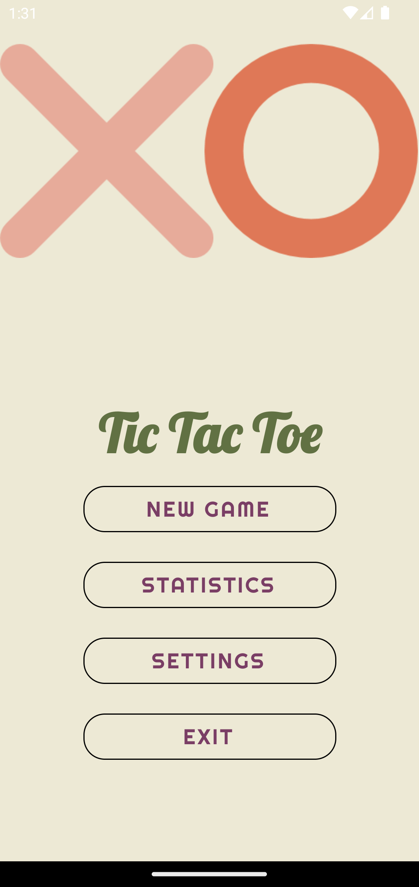
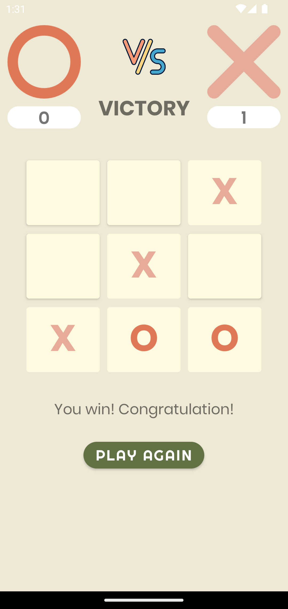
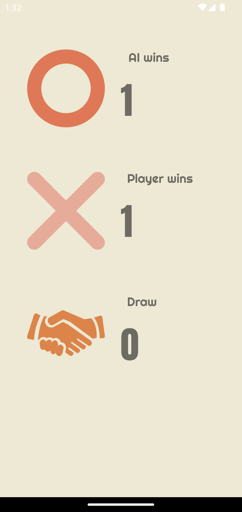
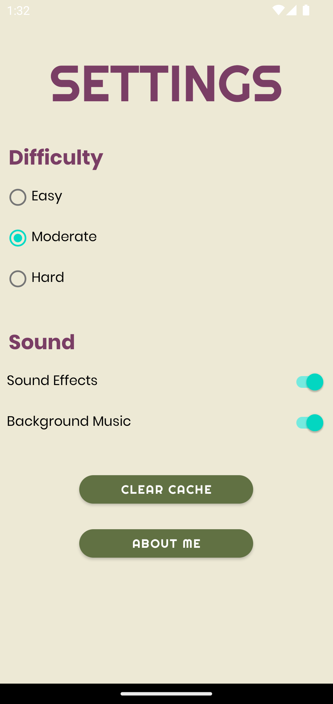

# TicTacToe - EE5415 Individual Project
Explore it on [Google Play](https://play.google.com/store/apps/details?id=com.chumyuenlaw.tictactoe)!

## Features
1. An individual menu.
2. Three difficulty levels.
3. Chinese and English localization.
4. Support land scale display mode on the gameboard.
5. Game data persist when switching the display modes.
6. Users can select the priority of drawing the signs first or later.
7. Background music and sound effects.
8. Clear historical battle information on the gameboard.
9. Exit button.
10. Animation on the main menu.
11. Settings page for difficulty, sound, Clear Cache, and About Me buttons.
12. An individual and more detailed page for historical battle statistics.
13. Harmonic and good-looking UI with different fonts and colors.  

## Screenshots

    

    

Welcome to star and fork!
